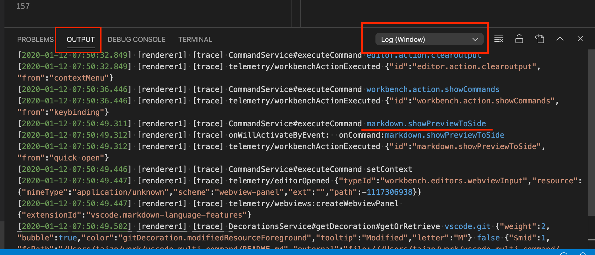

# multi-command README

This extension can create command sequence as one command and bind a key, or call it manually.

## Features

-   create command sequence as one command and bind a key.
-   call command sequence manually.
-   set interval between each command execution.

## Extension Settings

Settings has 2 steps.

1. Create command sequence as one command in settings.json.  
   For example:

    ```json
    "multiCommand.commands": [
        {
            "command": "multiCommand.down3Lines",
            "sequence": [
                "cursorDown",
                "cursorDown",
                "cursorDown"
            ]
        },
        {
            "command": "multiCommand.swapChar",
            "interval": 30,
            "sequence": [
                "cursorLeftSelect",
                "editor.action.clipboardCutAction",
                "cursorRight",
                "editor.action.clipboardPasteAction"
            ]
        }
    ]
    ```

    First sequence is named "multiCommand.down3Lines" and executes "cursorDown" command 3 times.

    Second sequence is named "multiCommand.swapChar". This sequence swaps cursor's left character and the right character. If a command is executed asynchronousely, you can set time interval between each command execution using "interval" configuration(milliseconds).

2. Bind a key to created command sequence in keybindings.json.  
   For example:

    ```json
    {
        "key": "F1",
        "command": "extension.multiCommand.execute",
        "args": { "command": "multiCommand.down3Lines" },
        "when": "editorTextFocus"
    },
    {
        "key": "F21",
        "command": "extension.multiCommand.execute",
        "args": { "command": "multiCommand.swapChar" },
        "when": "editorTextFocus"
    }
    ```

    You can bind a key to the command directly.

    For example:

    ```json
    {
        "key": "F1",
        "command": "multiCommand.down3Lines",
        "when": "editorTextFocus"
    },
    {
        "key": "F2",
        "command": "multiCommand.swapChar",
        "when": "editorTextFocus"
    }
    ```

    But when you use this key bind style, Visual Studio Code may warn about the command name. see: https://github.com/ryuta46/vscode-multi-command/issues/16

### Manual Execution

You can call a defined command sequence from command palette.

1. Open command palette ( cmd + shift + p in mac).
2. Choose "Multi command: Execute multi command."
3. Choose one of command sequences you defined.

If you want to call a command sequence in shorter steps, bind a key to "extension.multiCommand.execute".

For example:

```json
{
    "key": "cmd+shift+m",
    "command": "extension.multiCommand.execute"
}
```

If you set `label` and `description` parameters in settings.json, they are displayed when you choose a command sequence.
Both parameters are optional.

For example:

```json
   "multiCommand.commands": [
        {
            "command": "multiCommand.down3Lines",
            "label": "down3Lines",
            "description": "down the cursor in 3 times",
            "sequence": [
                "cursorDown",
                "cursorDown",
                "cursorDown"
            ]
        },
```

### Advanced Settings

#### Pass arguments to commands

You can pass arguments to commands by defining a command sequence with `args` parameter.
For Example:

```json
{
    "command": "multiCommand.cutAndType",
    "sequence": [
        "editor.action.clipboardCutAction",
        { "command": "type", "args": { "text": "CUT !!" } }
    ]
}
```

This sequence cut selected text and type "CUT !!".

### Find the name of the command you want to execute

1. Execute "Developer: Set Log Level..." and select "trace" in the command palette.

2. Execute command of you want to know the name.
3. You can see the name in output panel for Log(Window) process( you can set the process for output in the rightside of the output panel).
   

### Using shell commands in a command sequence

You can use shell commands in a command sequence by using [Command Runner](https://marketplace.visualstudio.com/items?itemName=edonet.vscode-command-runner) extension together.

With Command Runner extension, you can write a command sequence with shell commands as:

```json
{
    "command": "multiCommand.checkoutDevelop",
    "sequence": [
        {
            "command": "command-runner.run",
            "args": { "command": "git checkout develop" }
        },
        "git.sync"
    ]
}
```

See the [Command Runner document](https://marketplace.visualstudio.com/items?itemName=edonet.vscode-command-runner) for details on how to use the extension.

## Release Notes

### 1.4.0

Added new style for binding a key to created commands.

### 1.3.0

New Feature: Manual execution from command palette.

### 1.2.0

New Feature: Pass arguments to commands.

### 1.1.0

Reloads settings.json when the file is changed.  
Now, you can use a custom multi-command immediately after adding it in the settings.json without restarting vscode.

### 1.0.0

Initial release.
